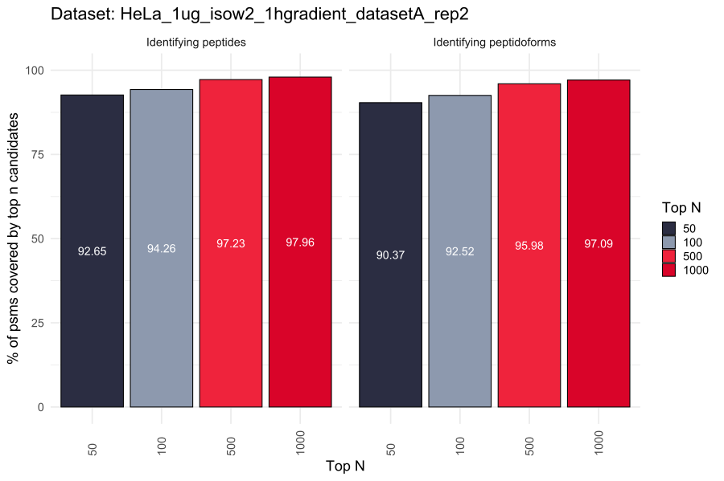

# CandidateSearch

Proof-of-concept implementation of a search engine that uses [CandidateVectorSearch](https://github.com/hgb-bin-proteomics/CandidateVectorSearch)
to identify the best peptide candidates for a given mass spectrum. *CandidateSearch* creates the vector encodings of peptides and spectra that are
needed for the sparse matrix search of *CandidateVectorSearch*.

*CandidateSearch* can identify peptide candidates from a given mass spectrum without any precursor ion/mass information and no previous knowledge about
potential fixed or variable modifications. *CandidateSearch* can also identify peptidoform candidates if a set of fixed and variable modifications
is provided. The aim of *CandidateSearch* is to reduce the search space for a given identification task by filtering out unlikely peptide or peptidoform
candidates. It is **NOT** meant to be a standalone search engine for peptide/peptidoform identification.

A simplified break down of the *CandidateSearch* algorithm is given in the following:
- Read the given MS2 spectra from the mgf file.
- Generate the encoding vectors for each spectrum.
- Transform spectrum encoding vectors into the representation needed for *CandidateVectorSearch*.
- Read the given fasta file.
- Digest the proteins of the fasta file into peptides.
- [Optional] Generate decoy peptides and peptidoforms.
- Calculate theoretical ion m/z values for all peptides.
- Generate the encoding vectors for each peptide.
- Transform the peptide encoding vectors into the representation needed for *CandidateVectorSearch*.
- Run *CandidateVectorSearch*.
- Process the results of *CandidateVectorSearch*.
- Create a csv file that maps every spectrum (scan number) to a list of the best *n* peptide candidates.
- Done!

## Usage

Running *CandidateSearch* requires three files:
- An mgf file containing MS2 spectra.
- A fasta file containing sample proteins.
- A settings file containing parameters for digestion, ion calculation and search (see below for an explanation of the settings file).

The *CandidateSearch* executable can then be run like this:

```bash
CandidateSearch.exe spectra.mgf database.fasta settings.txt
```

Example files that can be used to test *CandidateSearch* can be found in `/data`.

## Settings

The settings file accepts the following parameters:
- MAX_CLEAVAGES: The maximum number of allowed missed cleavages during digestion. (integer, default = 2)
- MIN_PEP_LENGTH: The minimum length of a peptide to be considered for search. (integer, default = 5)
- MAX_PEP_LENGTH: The maximum length of a peptide to be considered for search. (integer, default = 30)
- MAX_PRECURSOR_CHARGE: The maximum considered precursor ion charge. (integer, default = 4)
- MAX_FRAGMENT_CHARGE: The maximum considered fragment ion charge. (string, default = +1)
- MAX_NEUTRAL_LOSSES: The maximum number of neutral losses considered during ion calculation. (integer, default = 1)
- MAX_NEUTRAL_LOSS_MODS: The maximum number of neutral loss modifications considered during ion calculation. (integer, default = 2)
- FIXED_MODIFICATIONS: Fixed modifications that should be considered during search given as `(char)amino_acid:(double)modification_mass`. An example
would be carbamidomethylation of cysteine, which would be denoted as `C:57.021464;`. Several fixed modifications can be provided. (string, default = None)
- VARIABLE_MODIFICATIONS: Variable modifications that should be considered during search given as `(char)amino_acid:(double)modification_mass`. An example
would be oxidation of methionine, which would be denoted as `M:15.994915;`. Several variable modifications can be provided. If no modifications are
given, *CandidateSearch* will return the best scoring unmodified peptidoforms for a given spectrum. (string, default = None)
- DECOY_SEARCH: Whether decoy search should be performed or not. Accepts `true` or `false`. (bool, default = true)
- TOP_N: The number of best candidates that should be returned by the search. (integer, default = 1000)
- TOLERANCE: Tolerance used for matching theoretical ions to experimental peaks. Given in Dalton. (double, default = 0.02)
- NORMALIZE: Whether or not *CandidateVectorSearch* scores should be normalized before selecting the best *n* candidates. Accepts `true` or `false`.
(bool, default = false)
- USE_GAUSSIAN: Whether or not experimental peaks should be modelled as gaussian distributions with `mu = (m/z)` and `sigma = (tolerance/3)`.
Accepts `true` or `false`. (bool, default = true)  
- MODE: Search approach used by *CandidateVectorSearch*. One of the following (default = CPU_DV):
  - CPU_DV: Sparse matrix - dense vector search on the CPU.
  - CPU_DM: Sparse matrix - dense matrix search on the CPU.
  - CPU_SV: Sparse matrix - sparse vector search on the CPU.
  - CPU_SM: Sparse matrix - sparse matrix search on the CPU.
  - GPU_DV: Sparse matrix - dense vector search on the GPU (see [requirements](https://github.com/hgb-bin-proteomics/CandidateVectorSearch/blob/master/README.md)).
  - GPU_DM: Sparse matrix - dense matrix search on the GPU (see [requirements](https://github.com/hgb-bin-proteomics/CandidateVectorSearch/blob/master/README.md)).
  - GPU_SM: Sparse matrix - sparse matrix search on the GPU (see [requirements](https://github.com/hgb-bin-proteomics/CandidateVectorSearch/blob/master/README.md)).

For the last five parameters you might additionally want to check the documentation of
[CandidateVectorSearch](https://github.com/hgb-bin-proteomics/CandidateVectorSearch) to get a better understanding of their meaning.

An empty `settings.txt` file is a valid configuration for search (default parameters will be used), however not providing a settings file at all is
not valid.

An example `settings.txt` file is provided [here](https://github.com/hgb-bin-proteomics/CandidateSearch/blob/master/settings.txt).

Additionally its contents are listed below, which should help in understanding the formatting:

```
## DIGESTIONS PARAMETERS
MAX_CLEAVAGES = 2
MIN_PEP_LENGTH = 5
MAX_PEP_LENGTH = 30

## ION CALCULATION PARAMETERS
MAX_PRECURSOR_CHARGE = 4
MAX_FRAGMENT_CHARGE = +1
MAX_NEUTRAL_LOSSES = 1
MAX_NEUTRAL_LOSS_MODS = 2
#FIXED_MODIFICATIONS = None
FIXED_MODIFICATIONS = C:57.021464;
#VARIABLE_MODIFICATIONS = None
VARIABLE_MODIFICATIONS = M:15.994915;
#VARIABLE_MODIFICATIONS = M:15.994915;K:284.173607;

## SEARCH PARAMETERS
DECOY_SEARCH = true

## VECTOR SEARCH PARAMETERS
TOP_N = 1000
TOLERANCE = 0.02
NORMALIZE = false
USE_GAUSSIAN = true
MODE = CPU_DV
```

## Documentation

The code of this search engine is fully documented within the `.cs` code files. A good entry point is the main function of *CandidateSearch* which is
implemented [here](https://github.com/hgb-bin-proteomics/CandidateSearch/blob/master/CandidateSearch.cs). Documentation generated by
[Doxygen](https://github.com/doxygen/doxygen) is also available here:
[https://hgb-bin-proteomics.github.io/CandidateSearch/](https://hgb-bin-proteomics.github.io/CandidateSearch/)

## Limitations

This a proof-of-concept implementation that shows the applicability of our *CandidateVectorSearch* approach and not a fully fledged search engine,
therefore this implementation comes with a few limitations:

- We currently only have implemented tryptic digestion.
  - You can implement your own digestion [here](https://github.com/hgb-bin-proteomics/CandidateSearch/blob/master/amanda/FASTAParser.cs#L17-L22).
- We currently have not implemented support for N- or C-terminal modifications.
- We currently have only implemented support for one possible modification per amino acid.
- We only support spectra in centroid mode (we can't really do anything with spectra in profile mode).

## Results

Example results of *CandidateSearch* and results analysis are given in `tests`.



**Figure 1:** Identifying peptide candidates and peptidoform candidates with *CandidateSearch* in a
[HeLa dataset](https://www.ebi.ac.uk/pride/archive/projects/PXD007750) using the human swissprot database. The considered ground truth was
an [MS Amanda](https://ms.imp.ac.at/?goto=msamanda) search validated with [Percolator](https://github.com/percolator/percolator). For every
high-confidence PSM we checked if the identified peptide/peptidoform was among the top 50/100/500/1000 hits of *CandidateSearch*. We reach
almost 100% coverage within the first 1000 hits of *CandidateSearch*.

## Known Issues

[List of known issues](https://github.com/hgb-bin-proteomics/CandidateSearch/issues)

## Citing

If you are using [parts of] *CandidateSearch* please cite:

```
MS Annika 3.0 (publication wip)
```

## License

- [MIT](https://github.com/hgb-bin-proteomics/CandidateSearch/blob/master/LICENSE)

## Contact

[micha.birklbauer@fh-hagenberg.at](mailto:micha.birklbauer@fh-hagenberg.at)
