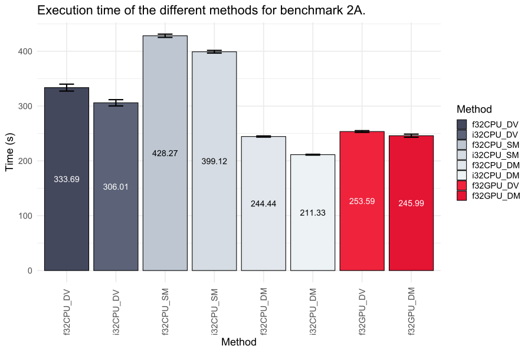
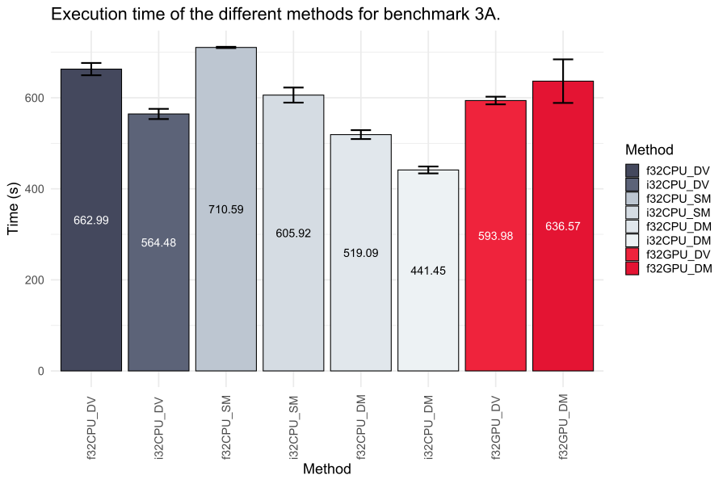
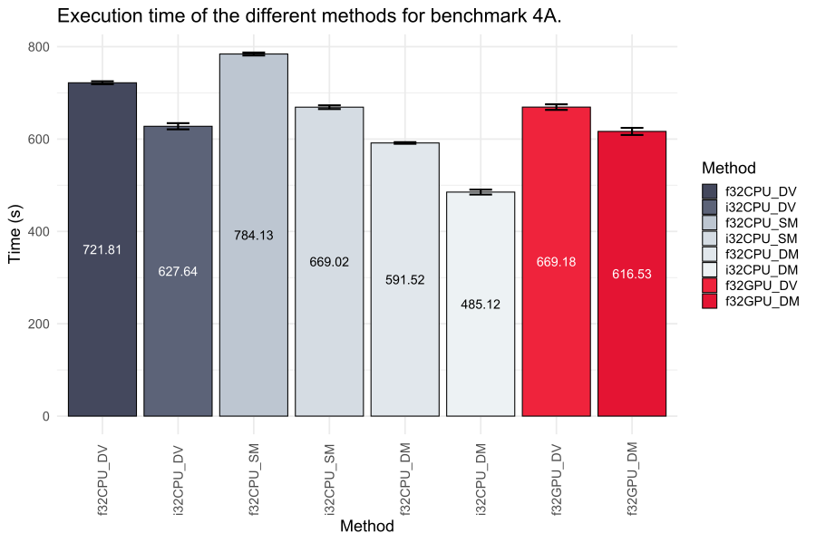

# Benchmarks

The following are benchmarks of the different sparse matrix/vector multiplication
methods of [Eigen](https://eigen.tuxfamily.org/) and
[cuSPARSE](https://docs.nvidia.com/cuda/cusparse/) that are implemented in
_CandidateSearch_ using real mass spectrometry data.

For all benchmarks we search the spectra from file
`benchmarks/XLpeplib_Beveridge_QEx-HFX_DSS_R1_deconvoluted.mgf` against the
database `benchmarks/Cas9+uniprotkb_proteome_UP000005640_AND_revi_2024_03_22.fasta`
(Cas9 + human SwissProt sequences) with settings `benchmarks/settings.txt`.

We ran every benchmark five times to get a more comprehensive overview of
computation times. The averages are plotted below, with error bars denoting
standard deviation. All benchmarks were conducted during light background usage
(e.g. open browser, text editor, etc.).

## Abbreviations

The following terms are used synonymously throughout the document:
- `f32CPU_SV`: Float32-(CPU-)based sparse matrix * sparse vector search (using [Eigen](https://eigen.tuxfamily.org/))
- `i32CPU_SV`: Int32-(CPU-)based sparse matrix * sparse vector search (using [Eigen](https://eigen.tuxfamily.org/))
- `f32CPU_DV`: Float32-(CPU-)based sparse matrix * dense vector search (using [Eigen](https://eigen.tuxfamily.org/))
- `i32CPU_DV`: Int32-(CPU-)based sparse matrix * dense vector search (using [Eigen](https://eigen.tuxfamily.org/))
- `f32CPU_SM`: Float32-(CPU-)based sparse matrix * sparse matrix search (using [Eigen](https://eigen.tuxfamily.org/))
- `i32CPU_SM`: Int32-(CPU-)based sparse matrix * sparse matrix search (using [Eigen](https://eigen.tuxfamily.org/))
- `f32CPU_DM`: Float32-(CPU-)based sparse matrix * dense matrix search (using [Eigen](https://eigen.tuxfamily.org/))
- `i32CPU_DM`: Int32-(CPU-)based sparse matrix * dense matrix search (using [Eigen](https://eigen.tuxfamily.org/))
- `f32GPU_DV`: Float32-(GPU-)based sparse matrix * dense vector search (using [cuSPARSE](https://docs.nvidia.com/cuda/cusparse/))
- `f32GPU_DM`: Float32-(GPU-)based sparse matrix * dense matrix search (using [cuSPARSE](https://docs.nvidia.com/cuda/cusparse/))
- `f32GPU_SM`: Float32-(GPU-)based sparse matrix * sparse matrix search (using [cuSPARSE](https://docs.nvidia.com/cuda/cusparse/))

## Hardware

The system we tested this on was a desktop PC with the following hardware:
- MB: ASUS ROG Strix B650E-I
- CPU: AMD Ryzen 7900X [12 cores @ 4.7 GHz base / 5.6 GHz boost]
- RAM: Kingston 64 GB DDR5 RAM [5600 MT/s, 36 CAS]
- GPU: ASUS Dual [Nvidia] GeForce RTX 4060 Ti OC [16 GB VRAM]*
- SSD/HDD: Corsair MP600 Pro NH 2 TB NVMe SSD [PCIe 4.0]
- OS: Windows 11 Pro 64-bit (10.0, Build 22631)

*_Note:_ `Dual` _is part of the name, this is a single graphics card!_

## Benchmarks

We ran four different parameter sets to also investigate the effects of parameter
`NORMALIZE` and parameter `USE_GAUSSIAN` on the performance.

### NORMALIZE = false && USE_GAUSSIAN = false

**Figure 1:** Int32-based sparse matrix * dense matrix search using
[Eigen](https://eigen.tuxfamily.org/) yields the fastest computation time of
170.17 seconds.

Expand for raw data!

| Method    |   Run 1 |   Run 2 |   Run 3 |   Run 4 |   Run 5 |     Min |     Max |    Mean |       SD |   Rank | Normalize   | Use Gaussian   | Spectra                                            | Database                                                      |
|:----------|--------:|--------:|--------:|--------:|--------:|--------:|--------:|--------:|---------:|-------:|:------------|:---------------|:---------------------------------------------------|:--------------------------------------------------------------|
| f32CPU_DV | 284.598 | 282.308 | 281.566 | 281.179 | 285.348 | 281.179 | 285.348 | 283     | 1.86529  |      6 | False       | False          | XLpeplib_Beveridge_QEx-HFX_DSS_R1_deconvoluted.mgf | Cas9+uniprotkb_proteome_UP000005640_AND_revi_2024_03_22.fasta |
| i32CPU_DV | 261.492 | 262.781 | 262.77  | 265.513 | 256.328 | 256.328 | 265.513 | 261.777 | 3.38113  |      5 | False       | False          | XLpeplib_Beveridge_QEx-HFX_DSS_R1_deconvoluted.mgf | Cas9+uniprotkb_proteome_UP000005640_AND_revi_2024_03_22.fasta |
| f32CPU_SM | 373.172 | 379.473 | 377.16  | 379.847 | 382.457 | 373.172 | 382.457 | 378.422 | 3.48481  |      8 | False       | False          | XLpeplib_Beveridge_QEx-HFX_DSS_R1_deconvoluted.mgf | Cas9+uniprotkb_proteome_UP000005640_AND_revi_2024_03_22.fasta |
| i32CPU_SM | 357.109 | 375.115 | 357.663 | 369.649 | 356.206 | 356.206 | 375.115 | 363.148 | 8.66346  |      7 | False       | False          | XLpeplib_Beveridge_QEx-HFX_DSS_R1_deconvoluted.mgf | Cas9+uniprotkb_proteome_UP000005640_AND_revi_2024_03_22.fasta |
| f32CPU_DM | 194.913 | 197.195 | 198.649 | 194.847 | 197.228 | 194.847 | 198.649 | 196.567 | 1.64775  |      4 | False       | False          | XLpeplib_Beveridge_QEx-HFX_DSS_R1_deconvoluted.mgf | Cas9+uniprotkb_proteome_UP000005640_AND_revi_2024_03_22.fasta |
| i32CPU_DM | 171.416 | 170.329 | 170.542 | 169.433 | 169.146 | 169.146 | 171.416 | 170.173 | 0.909477 |      1 | False       | False          | XLpeplib_Beveridge_QEx-HFX_DSS_R1_deconvoluted.mgf | Cas9+uniprotkb_proteome_UP000005640_AND_revi_2024_03_22.fasta |
| f32GPU_DV | 183.134 | 190.537 | 194.355 | 189.926 | 186.384 | 183.134 | 194.355 | 188.867 | 4.27386  |      2 | False       | False          | XLpeplib_Beveridge_QEx-HFX_DSS_R1_deconvoluted.mgf | Cas9+uniprotkb_proteome_UP000005640_AND_revi_2024_03_22.fasta |
| f32GPU_DM | 188.206 | 188.611 | 194.606 | 192.397 | 195.066 | 188.206 | 195.066 | 191.777 | 3.23992  |      3 | False       | False          | XLpeplib_Beveridge_QEx-HFX_DSS_R1_deconvoluted.mgf | Cas9+uniprotkb_proteome_UP000005640_AND_revi_2024_03_22.fasta |

### NORMALIZE = false && USE_GAUSSIAN = true

**Figure 2:** Int32-based sparse matrix * dense matrix search using
[Eigen](https://eigen.tuxfamily.org/) yields the fastest computation time of
211.33 seconds.

Expand for raw data!

| Method    |   Run 1 |   Run 2 |   Run 3 |   Run 4 |   Run 5 |     Min |     Max |    Mean |       SD |   Rank | Normalize   | Use Gaussian   | Spectra                                            | Database                                                      |
|:----------|--------:|--------:|--------:|--------:|--------:|--------:|--------:|--------:|---------:|-------:|:------------|:---------------|:---------------------------------------------------|:--------------------------------------------------------------|
| f32CPU_DV | 342.748 | 337.409 | 330.165 | 331.124 | 326.996 | 326.996 | 342.748 | 333.689 | 6.31853  |      6 | False       | True           | XLpeplib_Beveridge_QEx-HFX_DSS_R1_deconvoluted.mgf | Cas9+uniprotkb_proteome_UP000005640_AND_revi_2024_03_22.fasta |
| i32CPU_DV | 299.689 | 299.897 | 309.623 | 309.983 | 310.848 | 299.689 | 310.848 | 306.008 | 5.69166  |      5 | False       | True           | XLpeplib_Beveridge_QEx-HFX_DSS_R1_deconvoluted.mgf | Cas9+uniprotkb_proteome_UP000005640_AND_revi_2024_03_22.fasta |
| f32CPU_SM | 423.513 | 431.445 | 429.494 | 427.879 | 429.016 | 423.513 | 431.445 | 428.269 | 2.95429  |      8 | False       | True           | XLpeplib_Beveridge_QEx-HFX_DSS_R1_deconvoluted.mgf | Cas9+uniprotkb_proteome_UP000005640_AND_revi_2024_03_22.fasta |
| i32CPU_SM | 394.987 | 400.611 | 401.15  | 399.615 | 399.258 | 394.987 | 401.15  | 399.124 | 2.43362  |      7 | False       | True           | XLpeplib_Beveridge_QEx-HFX_DSS_R1_deconvoluted.mgf | Cas9+uniprotkb_proteome_UP000005640_AND_revi_2024_03_22.fasta |
| f32CPU_DM | 242.766 | 245.519 | 244.166 | 244.985 | 244.774 | 242.766 | 245.519 | 244.442 | 1.05473  |      2 | False       | True           | XLpeplib_Beveridge_QEx-HFX_DSS_R1_deconvoluted.mgf | Cas9+uniprotkb_proteome_UP000005640_AND_revi_2024_03_22.fasta |
| i32CPU_DM | 210.471 | 211.451 | 211.719 | 212.283 | 210.703 | 210.471 | 212.283 | 211.325 | 0.742546 |      1 | False       | True           | XLpeplib_Beveridge_QEx-HFX_DSS_R1_deconvoluted.mgf | Cas9+uniprotkb_proteome_UP000005640_AND_revi_2024_03_22.fasta |
| f32GPU_DV | 254.05  | 252.647 | 255.355 | 251.401 | 254.514 | 251.401 | 255.355 | 253.593 | 1.57015  |      4 | False       | True           | XLpeplib_Beveridge_QEx-HFX_DSS_R1_deconvoluted.mgf | Cas9+uniprotkb_proteome_UP000005640_AND_revi_2024_03_22.fasta |
| f32GPU_DM | 240.989 | 247.472 | 247.143 | 247.778 | 246.566 | 240.989 | 247.778 | 245.989 | 2.83103  |      3 | False       | True           | XLpeplib_Beveridge_QEx-HFX_DSS_R1_deconvoluted.mgf | Cas9+uniprotkb_proteome_UP000005640_AND_revi_2024_03_22.fasta |

### NORMALIZE = true && USE_GAUSSIAN = false

**Figure 3:** Int32-based sparse matrix * dense matrix search using
[Eigen](https://eigen.tuxfamily.org/) yields the fastest computation time of
441.45 seconds.

Expand for raw data!

| Method    |   Run 1 |   Run 2 |   Run 3 |   Run 4 |   Run 5 |     Min |     Max |    Mean |       SD |   Rank | Normalize   | Use Gaussian   | Spectra                                            | Database                                                      |
|:----------|--------:|--------:|--------:|--------:|--------:|--------:|--------:|--------:|---------:|-------:|:------------|:---------------|:---------------------------------------------------|:--------------------------------------------------------------|
| f32CPU_DV | 649.063 | 661.19  | 650.95  | 675.843 | 677.927 | 649.063 | 677.927 | 662.995 | 13.5136  |      7 | True        | False          | XLpeplib_Beveridge_QEx-HFX_DSS_R1_deconvoluted.mgf | Cas9+uniprotkb_proteome_UP000005640_AND_revi_2024_03_22.fasta |
| i32CPU_DV | 548.815 | 571.154 | 571.506 | 556.422 | 574.498 | 548.815 | 574.498 | 564.479 | 11.2317  |      3 | True        | False          | XLpeplib_Beveridge_QEx-HFX_DSS_R1_deconvoluted.mgf | Cas9+uniprotkb_proteome_UP000005640_AND_revi_2024_03_22.fasta |
| f32CPU_SM | 711.401 | 712.366 | 708.906 | 710.551 | 709.708 | 708.906 | 712.366 | 710.586 |  1.36252 |      8 | True        | False          | XLpeplib_Beveridge_QEx-HFX_DSS_R1_deconvoluted.mgf | Cas9+uniprotkb_proteome_UP000005640_AND_revi_2024_03_22.fasta |
| i32CPU_SM | 614.278 | 630.73  | 600.277 | 592.49  | 591.84  | 591.84  | 630.73  | 605.923 | 16.5517  |      5 | True        | False          | XLpeplib_Beveridge_QEx-HFX_DSS_R1_deconvoluted.mgf | Cas9+uniprotkb_proteome_UP000005640_AND_revi_2024_03_22.fasta |
| f32CPU_DM | 530.933 | 508.778 | 515.837 | 512.128 | 527.792 | 508.778 | 530.933 | 519.094 |  9.76414 |      2 | True        | False          | XLpeplib_Beveridge_QEx-HFX_DSS_R1_deconvoluted.mgf | Cas9+uniprotkb_proteome_UP000005640_AND_revi_2024_03_22.fasta |
| i32CPU_DM | 432.976 | 449.078 | 449.505 | 435.932 | 439.756 | 432.976 | 449.505 | 441.449 |  7.55284 |      1 | True        | False          | XLpeplib_Beveridge_QEx-HFX_DSS_R1_deconvoluted.mgf | Cas9+uniprotkb_proteome_UP000005640_AND_revi_2024_03_22.fasta |
| f32GPU_DV | 582.093 | 600.802 | 595.453 | 589.298 | 602.231 | 582.093 | 602.231 | 593.975 |  8.36706 |      4 | True        | False          | XLpeplib_Beveridge_QEx-HFX_DSS_R1_deconvoluted.mgf | Cas9+uniprotkb_proteome_UP000005640_AND_revi_2024_03_22.fasta |
| f32GPU_DM | 560.338 | 658.734 | 675.252 | 669.258 | 619.287 | 560.338 | 675.252 | 636.574 | 47.8698  |      6 | True        | False          | XLpeplib_Beveridge_QEx-HFX_DSS_R1_deconvoluted.mgf | Cas9+uniprotkb_proteome_UP000005640_AND_revi_2024_03_22.fasta |

### NORMALIZE = true && USE_GAUSSIAN = true

**Figure 4:** Int32-based sparse matrix * dense matrix search using
[Eigen](https://eigen.tuxfamily.org/) yields the fastest computation time of
485.12 seconds.

Expand for raw data!

| Method    |   Run 1 |   Run 2 |   Run 3 |   Run 4 |   Run 5 |     Min |     Max |    Mean |      SD |   Rank | Normalize   | Use Gaussian   | Spectra                                            | Database                                                      |
|:----------|--------:|--------:|--------:|--------:|--------:|--------:|--------:|--------:|--------:|-------:|:------------|:---------------|:---------------------------------------------------|:--------------------------------------------------------------|
| f32CPU_DV | 722.099 | 725.386 | 718.058 | 719.054 | 724.449 | 718.058 | 725.386 | 721.809 | 3.22115 |      7 | True        | True           | XLpeplib_Beveridge_QEx-HFX_DSS_R1_deconvoluted.mgf | Cas9+uniprotkb_proteome_UP000005640_AND_revi_2024_03_22.fasta |
| i32CPU_DV | 626.118 | 630.296 | 637.837 | 621.074 | 622.894 | 621.074 | 637.837 | 627.644 | 6.68956 |      4 | True        | True           | XLpeplib_Beveridge_QEx-HFX_DSS_R1_deconvoluted.mgf | Cas9+uniprotkb_proteome_UP000005640_AND_revi_2024_03_22.fasta |
| f32CPU_SM | 782.141 | 784.777 | 787.899 | 785.991 | 779.819 | 779.819 | 787.899 | 784.126 | 3.18703 |      8 | True        | True           | XLpeplib_Beveridge_QEx-HFX_DSS_R1_deconvoluted.mgf | Cas9+uniprotkb_proteome_UP000005640_AND_revi_2024_03_22.fasta |
| i32CPU_SM | 675.703 | 667.53  | 665.649 | 669.617 | 666.607 | 665.649 | 675.703 | 669.021 | 4.01312 |      5 | True        | True           | XLpeplib_Beveridge_QEx-HFX_DSS_R1_deconvoluted.mgf | Cas9+uniprotkb_proteome_UP000005640_AND_revi_2024_03_22.fasta |
| f32CPU_DM | 592.399 | 593.383 | 592.434 | 588.955 | 590.425 | 588.955 | 593.383 | 591.519 | 1.79273 |      2 | True        | True           | XLpeplib_Beveridge_QEx-HFX_DSS_R1_deconvoluted.mgf | Cas9+uniprotkb_proteome_UP000005640_AND_revi_2024_03_22.fasta |
| i32CPU_DM | 484.45  | 481.504 | 481.025 | 484.537 | 494.108 | 481.025 | 494.108 | 485.125 | 5.27773 |      1 | True        | True           | XLpeplib_Beveridge_QEx-HFX_DSS_R1_deconvoluted.mgf | Cas9+uniprotkb_proteome_UP000005640_AND_revi_2024_03_22.fasta |
| f32GPU_DV | 666.539 | 669.565 | 679.34  | 664.082 | 666.39  | 664.082 | 679.34  | 669.183 | 6.00249 |      6 | True        | True           | XLpeplib_Beveridge_QEx-HFX_DSS_R1_deconvoluted.mgf | Cas9+uniprotkb_proteome_UP000005640_AND_revi_2024_03_22.fasta |
| f32GPU_DM | 623.122 | 612.436 | 619.752 | 622.259 | 605.058 | 605.058 | 623.122 | 616.526 | 7.66539 |      3 | True        | True           | XLpeplib_Beveridge_QEx-HFX_DSS_R1_deconvoluted.mgf | Cas9+uniprotkb_proteome_UP000005640_AND_revi_2024_03_22.fasta |

## Conclusions

Generally on this machine Int32-based sparse matrix * dense matrix multiplication on the CPU
performs the fastest. It is also noticeable how Int32-based approaches consistently outperform
their Float32-based counterparts. Both of these statements are also true when using the HeLa
dataset for benchmarking, as recorded in benchmark B (data not shown here, see `benchmarks/vis_B`).
It should further be mentioned that this system features a high-end CPU and low-end GPU, claiming
that CPU-based approaches are faster than GPU-based approaches for the problem at hand would be
true for this particular system but does definitely not hold as a general statement.
