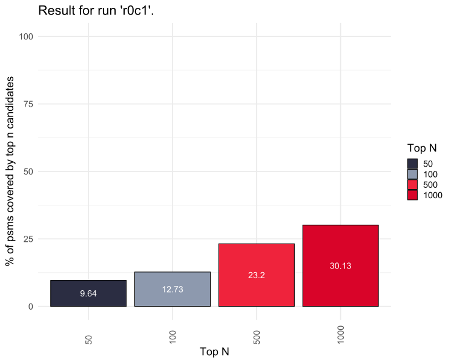
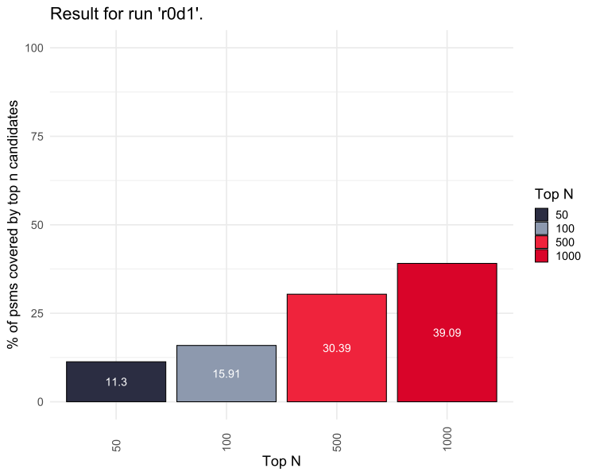
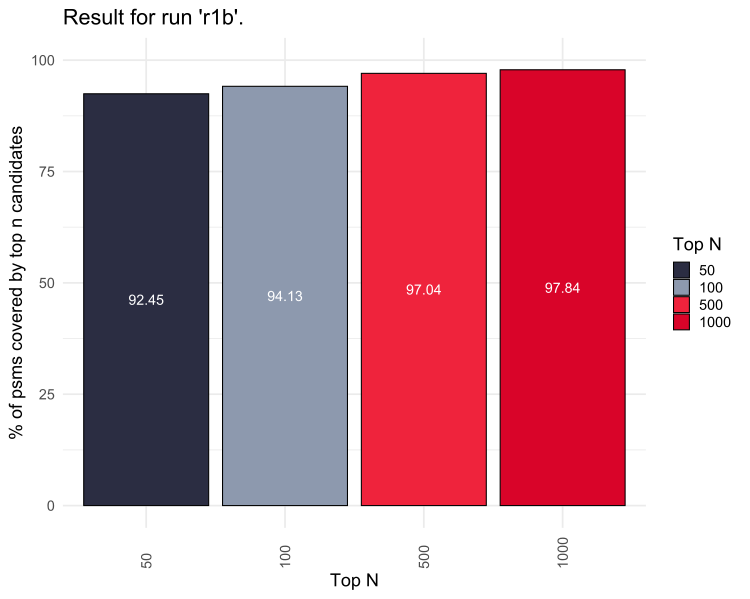
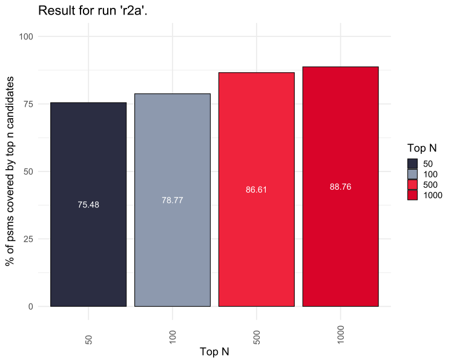
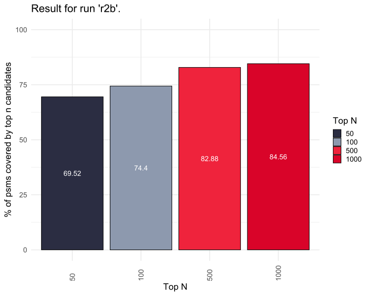

# Results

In order to assess the applicability of our candidate search, we first tested the
algorithm on linear peptides. This showed very good results, especially with
deconvoluted data. Moreover, we then also applied the algorithm to non-cleavable
crosslink data and once more saw good results.

## Test Methodology

For testing against linear peptides, mass spectrometry RAW data of HeLa cells was
retrieved from PRIDE via identifier [PXD007750](https://www.ebi.ac.uk/pride/archive/projects/PXD007750)
and then exported to mgf format with Proteome Discoverer 3.1, either directly or
with deisotoping and charge deconvolution. For comparison we searched the RAW data
with [MS Amanda](https://ms.imp.ac.at/?goto=msamanda) (version 3.1.21.45, Engine version 3.0.21.45, see search settings in Table 1)
and validated the results with[Percolator](https://github.com/percolator/percolator)
(version 3.05.0) for 1% estimated false discovery rate (FDR). For every high-confidence
peptide spectrum match (PSM) we then checked if the associated peptide was within
the *top N* peptide candidates returned by the algorithm.

The used database was `uniprotkb_proteome_UP000005640_AND_revi_2024_03_22.fasta` (Human SwissProt).

| Parameter              | Value                   |
|:-----------------------|:------------------------|
| MS1 Tolerance          | 5 ppm                   |
| MS2 Tolerance          | 10 ppm                  |
| Max. Missed Cleavages  | 2                       |
| Minimum Peptide Length | 5                       |
| Maximum Peptide Length | 30                      |
| Fixed Modification     | Carbamidomethylation(C) |
| Variable Modification  | Oxidation(M)            |

**Table 1:** Search settings used for [MS Amanda](https://ms.imp.ac.at/?goto=msamanda)
to identify PSMs.

For testing against cross-linked peptides, mass spectrometry RAW data was retrieved
from PRIDE via identifier [PXD014337](https://www.ebi.ac.uk/pride/archive/projects/PXD014337)
and exported the same way. For comparison we used available results from the cross-linking
search engine [MaxLynx](https://doi.org/10.1021/acs.analchem.1c03688) which were
also retrieved from PRIDE via identifier [PXD027159](https://www.ebi.ac.uk/pride/archive/projects/PXD027159).
Analogously, we checked for every high-confidence crosslink spectrum match (CSM)
if one of the associated peptides was within the *top N* peptide candidates returned
by the algorithm.

The used database was `cas9_uniprotkb_proteome_UP000005640_AND_revi_2024_03_22.fasta` (Human SwissProt + S. pyogenes Cas9). 

## Normalize = off, Gaussian = on [r0a]

Before analysing the complete datasets we studied the influence of the parameters
`NORMALIZE` and `USE_GAUSSIAN`. The following plots show the results using `NORMALIZE = false`
and `USE_GAUSSIAN = true` for replicate 1 using eiter RAW or deconvoluted spectra.

### raw [r0a1]

**Figure 1:** Results for [PXD007750](https://www.ebi.ac.uk/pride/archive/projects/PXD007750)
replicate 1 (RAW) using `NORMALIZE = false` and `USE_GAUSSIAN = true`.

### deconvoluted [r0a2]

**Figure 2:** Results for [PXD007750](https://www.ebi.ac.uk/pride/archive/projects/PXD007750)
replicate 1 (deconvoluted) using `NORMALIZE = false` and `USE_GAUSSIAN = true`.

## Normalize = off, Gaussian = off [r0b]

### raw [r0b1]

**Figure 3:** Results for [PXD007750](https://www.ebi.ac.uk/pride/archive/projects/PXD007750)
replicate 1 (RAW) using `NORMALIZE = false` and `USE_GAUSSIAN = false`.

### deconvoluted [r0b2]

**Figure 4:** Results for [PXD007750](https://www.ebi.ac.uk/pride/archive/projects/PXD007750)
replicate 1 (deconvoluted) using `NORMALIZE = false` and `USE_GAUSSIAN = false`.

## Normalize = on, Gaussian = off [r0c]

### raw [r0c1]

**Figure 5:** Results for [PXD007750](https://www.ebi.ac.uk/pride/archive/projects/PXD007750)
replicate 1 (RAW) using `NORMALIZE = true` and `USE_GAUSSIAN = false`.

### deconvoluted [r0c2]

**Figure 6:** Results for [PXD007750](https://www.ebi.ac.uk/pride/archive/projects/PXD007750)
replicate 1 (deconvoluted) using `NORMALIZE = true` and `USE_GAUSSIAN = false`.

## Normalize = on, Gaussian = on [r0d]

### raw [r0d1]

**Figure 7:** Results for [PXD007750](https://www.ebi.ac.uk/pride/archive/projects/PXD007750)
replicate 1 (RAW) using `NORMALIZE = true` and `USE_GAUSSIAN = true`.

### deconvoluted [r0d2]

**Figure 8:** Results for [PXD007750](https://www.ebi.ac.uk/pride/archive/projects/PXD007750)
replicate 1 (deconvoluted) using `NORMALIZE = true` and `USE_GAUSSIAN = true`.

## HeLa [r1]

It is pretty clear from *r0a1* to *r0d2* that parameter combination `NORMALIZE = true`
and `USE_GAUSSIAN = true` with deconvoluted spectra yields the best results. This
is what we therefore used for final analysis of all three replicates of the dataset.

### rep 1 [r1a]

**Figure 9:** Results for [PXD007750](https://www.ebi.ac.uk/pride/archive/projects/PXD007750)
replicate 1 (deconvoluted) using `NORMALIZE = false` and `USE_GAUSSIAN = true`.

### rep 2 [r1b]

**Figure 10:** Results for [PXD007750](https://www.ebi.ac.uk/pride/archive/projects/PXD007750)
replicate 2 (deconvoluted) using `NORMALIZE = false` and `USE_GAUSSIAN = true`.

### rep 3 [r1c]

**Figure 11:** Results for [PXD007750](https://www.ebi.ac.uk/pride/archive/projects/PXD007750)
replicate 3 (deconvoluted) using `NORMALIZE = false` and `USE_GAUSSIAN = true`.

## Beveridge [r2]

For the cross-linking data we used the same settings as for linear peptides: 
`NORMALIZE = false` and `USE_GAUSSIAN = true` using deconvoluted spectra.

### rep 1 [r2a]

**Figure 12:** Results for [PXD014337](https://www.ebi.ac.uk/pride/archive/projects/PXD014337)
replicate 1 (deconvoluted) using `NORMALIZE = false` and `USE_GAUSSIAN = true`.

### rep 2 [r2b]

**Figure 13:** Results for [PXD014337](https://www.ebi.ac.uk/pride/archive/projects/PXD014337)
replicate 2 (deconvoluted) using `NORMALIZE = false` and `USE_GAUSSIAN = true`.

### rep 3 [r2c]

**Figure 14:** Results for [PXD014337](https://www.ebi.ac.uk/pride/archive/projects/PXD014337)
replicate 3 (deconvoluted) using `NORMALIZE = false` and `USE_GAUSSIAN = true`.

## Data Availability

The full list of files for these tests can be accessed via [http://u.pc.cd/z75otalK](http://u.pc.cd/z75otalK).

## Conclusion

We could show that both for linear peptides and cross-linked peptides our algorithm
is capable of finding the correct peptide candidate for identification. Interestingly,
normalization does not improve results, quite contrary they get a lot worse. The best
results were achieved using deconvoluted spectra with parameter settings `NORMALIZE = false`
and `USE_GAUSSIAN = true`.
