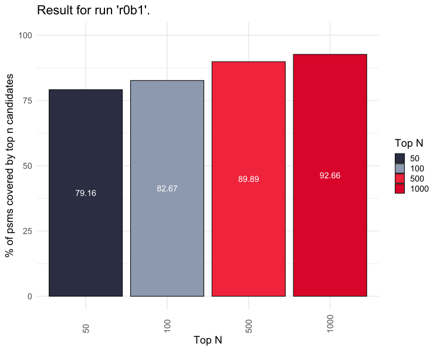
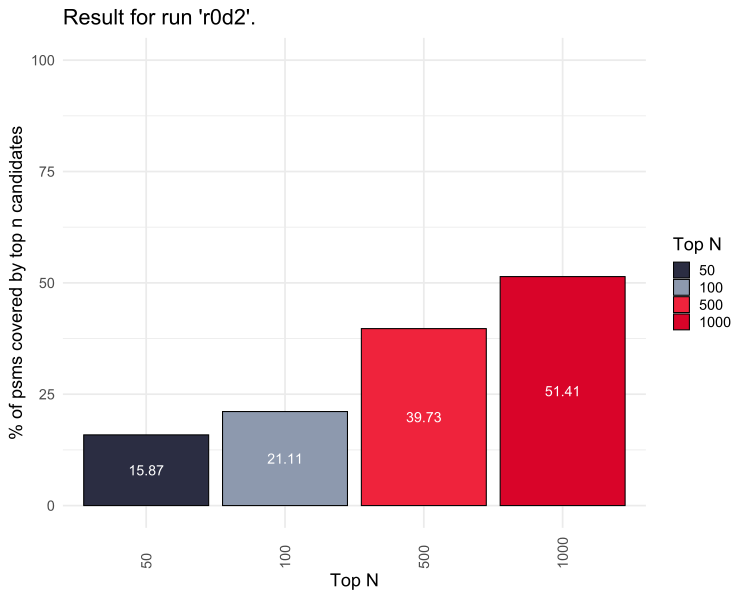

# Results

CharmeRT: https://www.ebi.ac.uk/pride/archive/projects/PXD007750
MaxLynx: https://www.ebi.ac.uk/pride/archive/projects/PXD027159
Beveridge: https://www.ebi.ac.uk/pride/archive/projects/PXD014337

Version MS Amanda: 3.1.21.45, Engine version 3.0.21.45
Version Percolator: 3.05.0

MS1: 5 ppm
MS2: 10 ppm
Cleavages: 2
Min: 5
Max: 30
Static: CarbaC
Dyn: OxiM

## Normalize = off, Gaussian = on [r0a]

### raw [r0a1]

### deconvoluted [r0a2]

## Normalize = off, Gaussian = off [r0b]

### raw [r0b1]

### deconvoluted [r0b2]

## Normalize = on, Gaussian = off [r0c]

### raw [r0c1]

### deconvoluted [r0c2]

## Normalize = on, Gaussian = on [r0d]

### raw [r0d1]

### deconvoluted [r0d2]

## HeLa [r1]

### rep 1 [r1a]

### rep 2 [r1b]

### rep 3 [r1c]

## Beveridge [r2]

### rep 1 [r2a]

### rep 2 [r2b]

### rep 3 [r2c]

## Data Availability

## Conclusion
